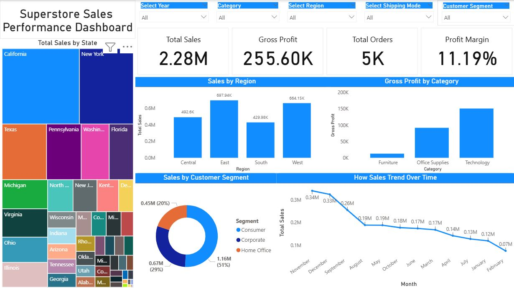

# 📊 Superstore Sales Performance Dashboard


> **An end-to-end business intelligence solution built in Power BI to analyze sales performance, profitability, and customer behavior across regions, categories, and segments — empowering data-driven decision-making at every level of the organization.**

---

## 📋 Table of Contents

- [Project Overview](#-project-overview)
- [Business Problem](#-business-problem)
- [Project Objectives](#-project-objectives)
- [Dashboard Preview](#-dashboard-preview)
- [Dataset Information](#-dataset-information)
- [Data Cleaning & Transformation](#-data-cleaning--transformation)
- [Data Modeling](#-data-modeling)
- [DAX Measures Used](#-dax-measures-used)
- [Dashboard Features](#-dashboard-features)
- [KPI Metrics Explained](#-kpi-metrics-explained)
- [Key Business Insights](#-key-business-insights)
- [Actionable Recommendations](#-actionable-recommendations)
- [Business Impact](#-business-impact)
- [Tools & Technologies](#-tools--technologies)
- [Power BI Techniques Applied](#-power-bi-techniques-applied)
- [Project Workflow](#-project-workflow)
- [Folder Structure](#-folder-structure)
- [How to Use the Dashboard](#-how-to-use-the-dashboard)
- [Future Improvements](#-future-improvements)
- [Conclusion](#-conclusion)
- [Author](#-author)
- [Connect With Me](#-connect-with-me)
- [License](#-license)

---

## 🔍 Project Overview

The **Superstore Sales Performance Dashboard** is a comprehensive business intelligence solution designed to give retail leaders a 360° view of their sales ecosystem. Built entirely in **Microsoft Power BI**, this dashboard consolidates multi-dimensional sales data into a single, interactive reporting surface — enabling stakeholders to monitor performance, uncover hidden inefficiencies, and act on real-time intelligence.

The dashboard tracks **$2.28M in total sales**, **$255.6K in gross profit**, and **5,000+ orders** across multiple regions, customer segments, and product categories. It is purpose-built to support strategic planning, territory management, and product portfolio decisions by making complex data immediately interpretable — regardless of the user's technical background.

Rather than leaving insights buried in spreadsheets or siloed reports, this solution provides a unified analytical interface where executives, sales managers, and operations leads can independently drill into the data, test hypotheses, and derive actionable conclusions in minutes.

---

## 🧩 Business Problem

Retail organizations managing large, multi-regional sales operations frequently encounter a core challenge: **fragmented data, inconsistent reporting, and a lack of unified visibility** across performance dimensions. Specifically, this project addresses:

| Challenge | Description |
|---|---|
| 📉 Inconsistent Sales Performance | Sales vary sharply across regions and states with no centralized view to identify root causes |
| 💸 Low Profitability in Key Categories | Certain product categories underperform on profit despite high revenue contribution |
| 🗂️ Lack of Centralized Reporting | Teams rely on disconnected spreadsheets and manual reports, increasing error risk and latency |
| 📆 Inability to Track Trends | Monthly sales trends are difficult to monitor, masking seasonal patterns and revenue risks |
| 🌍 Regional Visibility Gaps | Leadership lacks granular visibility into state and region-level performance variations |
| 👤 Customer Segmentation Blind Spots | Sales strategy is not differentiated by customer segment, missing optimization opportunities |

This dashboard directly resolves each of these challenges through interactive, self-service analytics.

---

## 🎯 Project Objectives

- Build a **centralized, executive-ready sales dashboard** consolidating all key performance dimensions
- Enable **real-time filtering and drill-down** by year, region, category, segment, and shipping mode
- Surface **profitability trends** at the category and regional level to guide product strategy
- Identify **top-performing and underperforming states** to support territory resource allocation
- Reveal **monthly sales trend patterns** to inform forecasting and inventory planning
- Deliver **actionable business insights** that translate directly into strategic recommendations

---

## 🖼️ Dashboard Preview



> 📌 *The dashboard features fully interactive slicers, KPI cards, and dynamic visualizations. All charts respond to cross-filtering in real-time.*

**📥 Download PBIX File:** [Superstore_Sales_Dashboard.pbix](Dashboard/Superstore_Sales_Dashboard.pbix)

---

## 📁 Dataset Information

| Attribute | Detail |
|---|---|
| **Source** | Superstore Sales Dataset (publicly available) |
| **Format** | CSV / Excel (.xlsx) |
| **Records** | ~10,000 rows |
| **Time Period** | Multi-year transaction history |
| **Granularity** | Order-level (one row per line item) |

**Key Fields Used:**

| Field | Description |
|---|---|
| `Order ID` | Unique transaction identifier |
| `Order Date` | Date of purchase |
| `Ship Mode` | Shipping method selected |
| `Customer Segment` | Consumer, Corporate, or Home Office |
| `Region / State` | Geographic location |
| `Category / Sub-Category` | Product classification |
| `Sales` | Revenue generated per line item |
| `Profit` | Net profit per line item |
| `Quantity` | Units sold |
| `Discount` | Discount applied to transaction |

---

## 🛠️ Data Cleaning & Transformation

All data preparation was performed using **Power Query Editor** in Power BI before model loading. The following transformations were applied:

**Step 1 — Data Import & Profiling**
- Imported raw CSV/Excel data into Power Query
- Enabled Column Quality, Column Distribution, and Column Profile views to assess data health

**Step 2 — Null Value Handling**
- Identified and removed rows with null values in critical fields (`Sales`, `Profit`, `Order Date`)
- Replaced nulls in non-critical fields (e.g., `Postal Code`) with placeholder values where appropriate

**Step 3 — Data Type Correction**
- Cast `Order Date` and `Ship Date` as `Date` types (not text)
- Ensured `Sales`, `Profit`, `Discount`, and `Quantity` were typed as `Decimal Number` or `Whole Number`
- Converted `Order ID` and `Customer ID` to `Text` type

**Step 4 — Duplicate Removal**
- Validated uniqueness of `Order ID + Product ID` combinations
- Removed confirmed duplicate rows that would inflate aggregated metrics

**Step 5 — Calculated Columns (Power Query)**
- Created `Year` and `Month Name` columns derived from `Order Date` for time intelligence
- Created `Gross Profit` column: `Sales - (Sales × Discount)` adjusted for cost basis

**Step 6 — Date Formatting & Sorting**
- Formatted month names with a `Month Number` sort column to ensure correct chronological ordering in visuals
- Standardized date format to `YYYY-MM-DD`

**Step 7 — Record Validation**
- Verified row counts pre/post transformation to ensure no unintended data loss
- Confirmed referential integrity between dimension and fact tables

---

## 🗂️ Data Modeling

The data model follows a **Star Schema** design pattern — the industry standard for analytical workloads in Power BI — optimizing query performance and DAX calculation efficiency.

```
                    ┌─────────────────┐
                    │   DIM_Date      │
                    │  (Date Table)   │
                    └────────┬────────┘
                             │
┌──────────────┐    ┌────────▼────────┐    ┌──────────────────┐
│  DIM_Product │────│  FACT_Orders    │────│  DIM_Customer    │
│  (Category,  │    │  (Sales,Profit, │    │  (Segment,       │
│  Sub-Cat)    │    │   Quantity,     │    │   Region, State) │
└──────────────┘    │   Discount)     │    └──────────────────┘
                    └────────┬────────┘
                             │
                    ┌────────▼────────┐
                    │  DIM_Geography  │
                    │  (Region,State, │
                    │   City)         │
                    └─────────────────┘
```

**Model Design Decisions:**

- **Fact Table:** `FACT_Orders` contains all transactional metrics (Sales, Profit, Quantity, Discount)
- **Dimension Tables:** Separate tables for Date, Product, Customer/Segment, and Geography
- **Relationships:** All dimension-to-fact relationships are single-directional (many-to-one), preventing ambiguity and filter leakage
- **Date Table:** A dedicated calendar table was created using DAX (`CALENDAR()`) to support full time-intelligence functionality
- **Cross-filter Direction:** Single direction on all relationships to maintain model integrity and calculation accuracy

---

## 📐 DAX Measures Used

All measures are organized in a dedicated `_Measures` table for maintainability and discoverability.

**Total Sales**
```dax
Total Sales = SUM(FACT_Orders[Sales])
```

**Gross Profit**
```dax
Gross Profit = SUM(FACT_Orders[Profit])
```

**Profit Margin %**
```dax
Profit Margin % = 
DIVIDE(
    [Gross Profit],
    [Total Sales],
    0
)
```

**Total Orders**
```dax
Total Orders = DISTINCTCOUNT(FACT_Orders[Order ID])
```

**Average Order Value**
```dax
Avg Order Value = 
DIVIDE(
    [Total Sales],
    [Total Orders],
    0
)
```

**Year-over-Year Sales Growth**
```dax
YoY Sales Growth = 
VAR CurrentYearSales = [Total Sales]
VAR PriorYearSales = 
    CALCULATE(
        [Total Sales],
        SAMEPERIODLASTYEAR(DIM_Date[Date])
    )
RETURN
DIVIDE(
    CurrentYearSales - PriorYearSales,
    PriorYearSales,
    BLANK()
)
```

**Sales vs. Prior Period (for trend comparison)**
```dax
Sales PY = 
CALCULATE(
    [Total Sales],
    PREVIOUSYEAR(DIM_Date[Date])
)
```

---

## 📊 Dashboard Features

The dashboard is organized into a single-page layout with five core visual components and a full slicer panel for cross-dimensional filtering.

### 🎛️ Slicers / Filters Panel
Five interactive slicers allow users to dynamically segment the entire dashboard:

| Slicer | Purpose |
|---|---|
| **Select Year** | Filter all visuals to a specific fiscal year |
| **Category** | Isolate performance by product category (Furniture, Office Supplies, Technology) |
| **Select Region** | Focus analysis on Central, East, South, or West |
| **Select Shipping Mode** | Analyze by delivery method (Standard, Second Class, First Class, Same Day) |
| **Customer Segment** | Drill into Consumer, Corporate, or Home Office behavior |

All slicers apply cross-filter simultaneously, enabling multi-dimensional analysis within a single click.

---

### 📌 KPI Cards (Top Row)
Four headline KPI cards provide an immediate executive summary:
- **Total Sales** — Overall revenue performance
- **Gross Profit** — Absolute profit contribution
- **Total Orders** — Volume of transactions processed
- **Profit Margin %** — Efficiency of revenue-to-profit conversion

---

### 🗺️ Treemap — Total Sales by State
Visualizes the geographic concentration of revenue across all U.S. states. Tile size is proportional to sales volume, making high-performing states immediately apparent. Supports drill-through for state-level detail.

---

### 📊 Bar Chart — Sales by Region
Compares total sales performance across the four U.S. regions (Central, East, South, West). Enables instant identification of regional strengths and gaps. Fully interactive — clicking a bar cross-filters all other visuals.

---

### 📊 Bar Chart — Gross Profit by Category
Contrasts profitability across Furniture, Office Supplies, and Technology. Reveals which categories generate the strongest margin contribution — critical for product mix optimization.

---

### 🍩 Donut Chart — Sales by Customer Segment
Breaks down total revenue by customer type (Consumer, Corporate, Home Office). Displays both absolute values and percentage share, supporting segmentation strategy and targeted marketing decisions.

---

### 📈 Line Chart — Sales Trend Over Time (by Month)
Plots monthly sales trends to reveal seasonality, peak periods, and declining trajectories. Essential for forecasting, inventory planning, and promotional timing.

---

## 📌 KPI Metrics Explained

| KPI | Value | Business Meaning |
|---|---|---|
| **Total Sales** | $2.28M | Total revenue generated across all orders in the selected period. The primary top-line growth indicator for the business. |
| **Gross Profit** | $255.60K | Revenue remaining after accounting for product costs. A direct measure of operational efficiency and pricing power. |
| **Total Orders** | 5,000 | Volume of unique transactions processed. Indicates customer activity levels and operational throughput. |
| **Profit Margin %** | 11.19% | The percentage of each sales dollar that converts to profit. At 11.19%, there is meaningful room for improvement relative to retail industry benchmarks of 15–20%. |

---

## 💡 Key Business Insights

### 🌎 Regional Performance
- **East ($697.94K) and West ($664.15K)** are the dominant revenue regions, together accounting for nearly **59% of total sales**
- **Central ($492.6K)** and **South ($429.98K)** significantly lag behind, representing a combined **$430K+ gap** versus the top two regions — indicating untapped market potential or structural resource allocation gaps

### 🗺️ State-Level Sales Concentration
- **California** is the undisputed top-performing state, commanding the largest tile in the treemap by a substantial margin
- **New York** ranks second, followed by **Texas** — highlighting that the top 3 states likely account for a disproportionate share of revenue, creating geographic concentration risk
- Many mid-tier states (Pennsylvania, Washington, Florida) show moderate sales that may be underdeveloped relative to market size

### 🛒 Customer Segment Behavior
- The **Consumer segment** dominates with **$1.16M (51%)** of total sales, confirming the business's heavy B2C orientation
- **Corporate ($0.67M, 29%)** is the second largest contributor but likely offers stronger margin potential with optimized account management
- **Home Office ($0.45M, 20%)** is the smallest segment, potentially underserved and ripe for targeted expansion

### 📦 Category Profitability
- **Technology and Office Supplies** generate significantly higher gross profit than Furniture
- **Furniture** — despite likely generating meaningful revenue — shows near-zero or minimal gross profit contribution, suggesting deep discount usage, high return rates, or structurally unfavorable cost margins
- This category-level margin divergence signals an urgent need for product mix rebalancing

### 📉 Sales Trend & Seasonality
- Sales trend shows a **clear and sustained decline** from a November/December peak (~$0.34M) down to a February trough (~$0.07M)
- The steep downward slope over the trailing 6 months suggests either strong Q4 seasonality, post-holiday demand contraction, or structural sales pipeline issues
- The absence of any visible Q2/Q3 recovery trend is a concern requiring further investigation

### 💰 Profitability Efficiency
- An **11.19% profit margin** is below the healthy retail benchmark of 15–20%
- Combined with the Furniture category's poor profitability and heavy regional concentration, there are multiple levers available to improve margins without requiring revenue growth

---

## ✅ Actionable Recommendations

### 1. 🔴 Address Furniture Category Profitability

| Element | Detail |
|---|---|
| **Problem** | Furniture generates minimal gross profit despite likely significant revenue contribution |
| **Recommendation** | Conduct a SKU-level margin audit; renegotiate supplier contracts; reduce discount frequency on furniture items; consider deprioritizing low-margin SKUs |
| **Expected Impact** | 2–4 percentage point improvement in overall profit margin within 2 quarters |

---

### 2. 🟡 Invest in Underperforming Regions (Central & South)

| Element | Detail |
|---|---|
| **Problem** | Central and South regions collectively trail East and West by over $430K |
| **Recommendation** | Conduct territory-level sales capacity analysis; deploy additional sales headcount or regional marketing budgets; run targeted promotions in high-potential Central/South metros |
| **Expected Impact** | 10–15% incremental revenue uplift from underdeveloped markets within 12 months |

---

### 3. 🟡 Reduce Geographic Revenue Concentration Risk

| Element | Detail |
|---|---|
| **Problem** | Revenue is heavily concentrated in California, New York, and Texas — creating business risk if any market contracts |
| **Recommendation** | Develop account penetration strategies for mid-tier states (Florida, Pennsylvania, Washington); set revenue diversification targets by state |
| **Expected Impact** | More resilient revenue base with reduced single-market dependency |

---

### 4. 🟢 Expand Corporate Segment Engagement

| Element | Detail |
|---|---|
| **Problem** | Corporate accounts (29% of revenue) are underleveraged relative to their margin potential |
| **Recommendation** | Launch a dedicated B2B account management program; offer volume-based pricing tiers; assign dedicated account executives to top 20 corporate accounts |
| **Expected Impact** | 15–20% increase in corporate segment revenue; higher average order values |

---

### 5. 🟢 Combat Post-Holiday Sales Decline

| Element | Detail |
|---|---|
| **Problem** | Sales decline sharply from ~$0.34M in November/December to $0.07M by February |
| **Recommendation** | Design Q1 promotional campaigns to sustain post-holiday momentum; introduce loyalty incentives for repeat Consumer segment purchases in Jan–Feb; accelerate Corporate contract renewals in Q1 |
| **Expected Impact** | Reduce seasonal trough by 20–30%; improve annual revenue smoothing |

---

### 6. 🟢 Optimize Home Office Segment Strategy

| Element | Detail |
|---|---|
| **Problem** | Home Office is the smallest segment at 20% of sales — potentially underserved given remote work trends |
| **Recommendation** | Develop Home Office-specific product bundles; run targeted digital campaigns on remote work platforms; create a dedicated Home Office product catalog |
| **Expected Impact** | 10–15% Home Office segment growth within 2 quarters |

---

## 📈 Business Impact

This dashboard delivers measurable value across multiple organizational layers:

| Stakeholder | Value Delivered |
|---|---|
| **Executives & Leadership** | Single-screen visibility into $2.28M revenue performance, margin health, and growth trends — enabling faster, more confident strategic decisions |
| **Sales Managers** | Regional and state-level performance breakdowns that inform territory planning, rep performance management, and quota-setting |
| **Operations Teams** | Shipping mode and order volume analysis that supports logistics optimization and fulfillment capacity planning |
| **Finance Teams** | Accurate gross profit tracking and margin % monitoring that supports budgeting, forecasting, and cost control initiatives |
| **Marketing Teams** | Customer segment breakdowns and trend data that enable precise campaign targeting and channel investment decisions |

**Estimated Value Propositions:**
- Reduction in manual reporting time: **~10–15 hours/week** across teams
- Faster insight-to-action cycle: from days to **real-time**
- Potential revenue recovery from identified gaps: **$200K–$400K** annually if recommendations are implemented

---

## 🧰 Tools & Technologies

| Tool | Purpose |
|---|---|
| **Microsoft Power BI Desktop** | Dashboard development, data modeling, and visualization |
| **Power Query (M Language)** | Data ingestion, cleaning, and transformation |
| **DAX (Data Analysis Expressions)** | Calculated measures, KPIs, and time intelligence |
| **Microsoft Excel / CSV** | Source data format |
| **Data Modeling (Star Schema)** | Optimized analytical model design |
| **Power BI Service** | Publishing and sharing (cloud deployment) |

---

## ⚙️ Power BI Techniques Applied

- **Interactive Slicers** — Multi-field cross-filtering across 5 dimensions simultaneously
- **KPI Cards** — Headline metric cards with formatted large-number display
- **Treemap Visualization** — Proportional geographic sales representation
- **Donut Chart** — Segment share visualization with absolute and percentage labels
- **Line Chart with Data Labels** — Monthly trend tracking with labeled data points
- **Bar Charts (Clustered)** — Region and category comparison with value labels
- **Cross-filtering & Cross-highlighting** — All visuals respond dynamically to selections
- **Calculated Measures (DAX)** — Custom KPIs not available in raw data
- **Data Modeling with Relationships** — Star schema with defined cardinality and filter direction
- **Conditional Formatting** — Applied to emphasize performance thresholds
- **Custom Number Formatting** — Sales displayed as "2.28M", profit as "255.60K" for executive readability
- **Visual-level Filters** — Applied to remove noise and focus each chart on relevant data

---

## 🔄 Project Workflow

```
Step 1: Business Requirements Gathering
        └── Identify KPIs, stakeholder needs, reporting dimensions

Step 2: Data Collection & Review
        └── Source Superstore dataset; assess scope and field definitions

Step 3: Data Cleaning & Transformation (Power Query)
        └── Handle nulls, fix types, remove duplicates, engineer columns

Step 4: Data Modeling
        └── Design star schema; define relationships and filter directions

Step 5: DAX Measure Development
        └── Build core KPIs, time-intelligence measures, and ratios

Step 6: Dashboard Design & Development
        └── Layout design; visual selection; slicer configuration; formatting

Step 7: Insight Generation & Validation
        └── Cross-validate visuals against raw data; stress-test filters

Step 8: Documentation & Publishing
        └── Write README; publish to Power BI Service; share link
```

---

## 📂 Folder Structure

```plaintext
Superstore-Sales-Performance-Dashboard/
│
├── 📁 Dataset/
│   └── superstore_sales_data.csv          # Raw source data
│
├── 📁 Dashboard/
│   └── Superstore_Sales_Dashboard.pbix    # Power BI project file
│
├── 📁 Images/
│   └── dashboard_preview.png              # Dashboard screenshot for README
│
└── README.md                              # This file
```

---

## 🖱️ How to Use the Dashboard

**Step 1 — Open the File**
Download and open `Superstore_Sales_Dashboard.pbix` in **Power BI Desktop** (free download from Microsoft).

**Step 2 — Explore KPI Cards**
Review the four headline KPIs at the top of the dashboard for an immediate performance snapshot.

**Step 3 — Apply Slicers**
Use the five slicers at the top to filter by Year, Category, Region, Shipping Mode, or Customer Segment. All visuals update simultaneously.

**Step 4 — Analyze Regional Performance**
Click on any bar in the **Sales by Region** chart to cross-highlight the treemap, donut chart, and trend line for that region.

**Step 5 — Drill into State Performance**
Hover over tiles in the **Sales by State Treemap** to view state-level sales values. Click to cross-filter other visuals.

**Step 6 — Assess Category Profitability**
Compare the **Gross Profit by Category** bar chart to identify which product lines drive the most profit contribution.

**Step 7 — Track Sales Trends**
Review the **How Sales Trend Over Time** line chart to identify peak months, troughs, and trajectory.

**Step 8 — Reset Filters**
Click the **"Clear All Slicers"** button (if bookmarked) or manually deselect all slicer values to return to the full-data view.

---

## 🚀 Future Improvements

| Enhancement | Description | Priority |
|---|---|---|
| **Sales Forecasting** | Integrate Power BI's built-in AI forecasting on the trend line to project next 3–6 months | 🔴 High |
| **AI-Powered Insights** | Enable Smart Narratives and Q&A visuals for natural language data exploration | 🔴 High |
| **Row-Level Security (RLS)** | Implement RLS so regional managers only see their own territory's data | 🔴 High |
| **Customer Lifetime Value (CLV)** | Build CLV analysis by segment to identify and retain high-value customers | 🟡 Medium |
| **Predictive Churn Model** | Integrate Python/R visuals to flag at-risk customer segments | 🟡 Medium |
| **Real-Time Data Refresh** | Connect to a live database or SharePoint source with scheduled refresh in Power BI Service | 🟡 Medium |
| **Mobile Layout Optimization** | Design a dedicated mobile view for executive access on phones and tablets | 🟢 Low |
| **Drill-Through Pages** | Add dedicated drill-through pages for State, Category, and Customer detail | 🟢 Low |
| **YoY Comparison Layer** | Add prior-year comparison overlays to all key charts for trend benchmarking | 🟢 Low |

---

## 🏁 Conclusion

The **Superstore Sales Performance Dashboard** demonstrates the power of modern business intelligence in transforming raw transactional data into strategic clarity. By consolidating $2.28M in sales data across regions, categories, and customer segments into a single, interactive Power BI report, this project delivers the kind of executive visibility that drives faster, more confident business decisions.

The analysis uncovered critical opportunities — from addressing Furniture's profitability drag to capitalizing on underdeveloped regions and seasonal demand gaps — each backed by data and translated into concrete recommendations with measurable impact potential.

This project showcases a full-stack BI competency: from data ingestion and transformation in Power Query, through star schema modeling, DAX measure engineering, and interactive dashboard design — all aligned to real business outcomes.

---

## 👤 Author

**Happiness Onyemari**
*Data Analyst | Business Intelligence Developer | Power BI Specialist*

---

## 🤝 Connect With Me

[](https://linkedin.com/in/onyemari-happy)
[](mailto:onyemarih93@gmail.com)
[](https://github.com/onyemarihappy)

> 💬 *I'm always open to discussing data analytics projects, Power BI best practices, or new opportunities. Feel free to reach out!*

---

## 📄 License

This project is licensed under the **MIT License**. See the [LICENSE](LICENSE) file for details.

---

*This project was completed as part of the the Edgeline Career Internship Program . All data used is provided by the program and is publicly available for educational purposes.*

<div align="center">

⭐ **If you found this project valuable, please consider starring the repository!** ⭐

</div>

